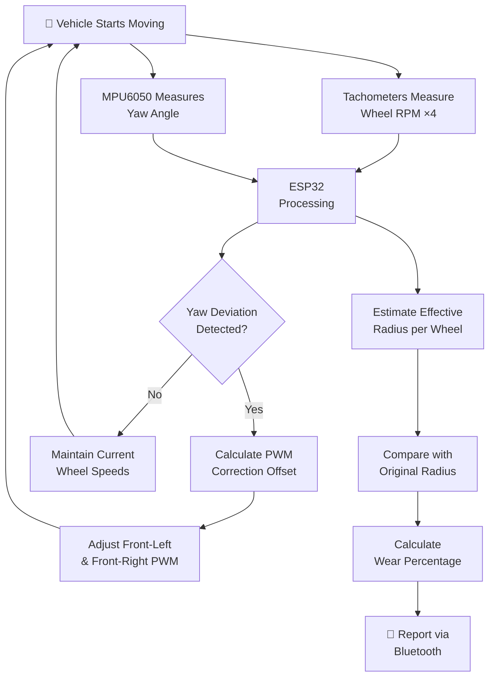

# Tyre Wear Detection & Straight-Line Correction System

An ESP32-based embedded system that detects tyre wear through real-time effective radius estimation and autonomously corrects vehicle trajectory deviation caused by unequal tyre sizes.

> Developed at **[IIITDM Kancheepuram](https://www.iiitdm.ac.in/)** under the mentorship of **Dr. Karthik C**, Department of Design.

---

## Overview

When a tyre wears over time, its effective rolling radius decreases. If the tyres on a vehicle do not share the same effective radius, the wheels travel different linear distances per revolution — even at the same rotational speed. This mismatch causes the vehicle to gradually drift from its intended straight-line path.

This project addresses the problem with a **dual-function system**:

1. **Trajectory Correction** — Detects and corrects the vehicle's drift using closed-loop feedback control with differential wheel speed adjustment.
2. **Tyre Wear Estimation** — Estimates the effective radius of each wheel in real time and compares it against the known original radius to quantify wear.

For the prototype, one wheel is intentionally fitted with a **smaller-radius tyre** to simulate a controlled, measurable tyre-wear condition.

---

## Key Features

- **Individual wheel RPM measurement** using 4 tachometer sensors with 20-hole encoder discs
- **IMU-based yaw deviation detection** via MPU6050 gyroscope integration
- **Closed-loop trajectory correction** through differential front-wheel PWM control
- **Effective tyre radius estimation** from RPM ratios against a reference wheel
- **Tyre wear percentage calculation** by comparing estimated radius with the original
- **IMU velocity estimation** with first-run tachometer-based scale calibration
- **Bluetooth telemetry** for wireless real-time monitoring via any serial terminal app
- **Iterative correction** — the system accumulates and improves corrections across successive runs

---

## System Architecture



---

## Hardware Components

| Component | Model / Specification | Qty | Role |
|---|---|:---:|---|
| Microcontroller | ESP32 WROOM | 1 | Central processing, sensor reading, motor control |
| IMU Sensor | MPU6050 (GY-521) | 1 | Gyroscope-based yaw deviation detection |
| Motor Driver | TB6612FNG | 2 | PWM-controlled motor power switching |
| Tachometer Sensor | IR Slot-type Encoder | 4 | Individual wheel RPM measurement |
| DC Motors | Geared DC Motor | 4 | Wheel drive |
| Encoder Disc | 20-hole disc | 4 | Pulse generation for RPM calculation |
| Chassis | 4WD car chassis kit | 1 | Vehicle body and wheel mounts |
| Power Supply | Li-ion / Battery pack | 1 | System power |

> For detailed hardware descriptions and wiring, see [`docs/HARDWARE.md`](docs/HARDWARE.md).

---

## Pin Configuration

### Motor Wiring

| Motor Position | IN1 | IN2 | PWM |
|---|:---:|:---:|:---:|
| Front-Left (FL) | GPIO 14 | GPIO 12 | GPIO 13 |
| Rear-Left (RL) | GPIO 4 | GPIO 2 | GPIO 15 |
| Front-Right (FR) | GPIO 26 | GPIO 27 | GPIO 25 |
| Rear-Right (RR) | GPIO 33 | GPIO 32 | GPIO 5 |

### Sensor Wiring

| Sensor | GPIO Pin |
|---|:---:|
| Tachometer 1 (FL) | GPIO 16 |
| Tachometer 2 (FR) | GPIO 17 |
| Tachometer 3 (RL) | GPIO 18 |
| Tachometer 4 (RR) | GPIO 19 |
| MPU6050 SDA | GPIO 21 |
| MPU6050 SCL | GPIO 22 |

---

## How It Works

### Phase 1 — Calibration

When the `GO` command is sent via Bluetooth:
- The gyroscope is calibrated over **200 samples** (~1 second) to find the zero-rate offset.
- The accelerometer is calibrated over **500 samples** (~1 second) to find the resting offset.
- The vehicle must remain **stationary** during this phase (~3 seconds total).

### Phase 2 — Driving & Measurement

The vehicle drives forward at a base PWM speed (100/255) for **5 seconds**. During this run:
- The **MPU6050** continuously integrates gyroscope Z-axis readings to track the yaw angle.
- **4 tachometers** count wheel revolutions through 20-hole encoder discs via hardware interrupts.
- **IMU acceleration** is integrated over time to estimate the vehicle's linear velocity.

### Phase 3 — Correction Calculation

After each run, the accumulated yaw deviation is used to compute a correction:

$$\text{correction} = \text{GAIN} \times \text{yaw\_deviation}$$

This correction is applied as a **differential offset** to the front wheels:

$$\text{Left PWM} = \text{Base Speed} + \text{offset}$$

$$\text{Right PWM} = \text{Base Speed} - \text{offset}$$

Rear wheels maintain constant speed for stability. Corrections **accumulate across runs**, so each successive `GO` further straightens the trajectory.

### Phase 4 — Radius Estimation

Using the Front-Right wheel as the **reference** (radius = 3.25 cm), the effective radius of each wheel is estimated from the RPM ratio:

$$r_{wheel} = \frac{RPM_{reference}}{RPM_{wheel}} \times r_{reference}$$

### Phase 5 — Wear Calculation

$$\text{Wear} = R_{original} - R_{current}$$

$$\text{Wear \%} = \frac{R_{original} - R_{current}}{R_{original}} \times 100$$

---

## Getting Started

### Prerequisites

- [Arduino IDE](https://www.arduino.cc/en/software) (v2.0 or later) with the **ESP32 board package** installed
- A USB cable for programming the ESP32
- A Bluetooth Serial terminal app on your smartphone (e.g., [Serial Bluetooth Terminal](https://play.google.com/store/apps/details?id=de.kai_morich.serial_bluetooth_terminal) for Android)

### Installing ESP32 Board Package

1. In Arduino IDE, go to **File → Preferences**
2. In "Additional Board Manager URLs", add:
   ```
   https://raw.githubusercontent.com/espressif/arduino-esp32/gh-pages/package_esp32_index.json
   ```
3. Go to **Tools → Board → Boards Manager**, search for `esp32`, and install it.

### Uploading the Code

1. Clone this repository:
   ```bash
   git clone https://github.com/YOUR-USERNAME/tyre-wear-detection-system.git
   ```
2. Open `src/tyre_wear_detection/tyre_wear_detection.ino` in Arduino IDE.
3. Go to **Tools → Board** and select **"ESP32 Dev Module"**.
4. Select the correct serial **Port** under **Tools → Port**.
5. Click the **Upload** button (→ arrow).

### Running the System

1. Power on the vehicle and place it on a flat surface.
2. Open the Bluetooth terminal app on your phone.
3. Pair with and connect to **`ESP32_CAR`**.
4. Type `GO` and press Send.
5. **Keep the vehicle stationary** for ~3 seconds during calibration.
6. The vehicle will drive forward for 5 seconds, then stop and report results.
7. Send `GO` again — corrections from the previous run are now applied.
8. Repeat to observe the trajectory progressively straightening.

### Sample Output

```
===================================
Run #2
-----------------------------------
Yaw:        -1.250 deg
Correction: L=2  R=-2
-----------------------------------
RPM:
  FL: 120.0   RL: 118.5
  FR: 121.0   RR: 119.0
-----------------------------------
Tyre Radius (cm):
  FL: 3.21   RL: 3.25
  FR: 3.18   RR: 3.24
-----------------------------------
===================================
Send GO
```

---

## Project Structure

```
tyre-wear-detection-system/
│
├── README.md                                  # Project overview (this file)
├── LICENSE                                    # MIT License
├── .gitignore                                 # Git ignore rules
│
├── src/
│   └── tyre_wear_detection/
│       └── tyre_wear_detection.ino            # ESP32 firmware source code
│
├── docs/
│   ├── PROJECT_REPORT.md                      # Detailed technical report
│   └── HARDWARE.md                            # Hardware specs and wiring guide
│
└── images/                                    # Add your photos and diagrams here
    └── .gitkeep
```

---

## Mathematical Foundation

| Concept | Equation | Description |
|---|---|---|
| Linear velocity | $v = \omega \cdot r$ | Relates wheel rotation to ground speed |
| Angular velocity | $\omega = \frac{2\pi N}{60}$ | Converts RPM to rad/s |
| Radius estimation | $r = \frac{v}{\omega}$ | Derives effective radius from speed and rotation |
| Velocity from IMU | $v = \int a \, dt$ | Integrates accelerometer data over time |
| Absolute wear | $\Delta r = R_{original} - R_{current}$ | Difference between original and estimated radius |
| Wear percentage | $W\% = \frac{\Delta r}{R_{original}} \times 100$ | Wear expressed as percentage of original |

---

## Key Parameters

| Parameter | Value | Description |
|---|---|---|
| `BASE_SPEED` | 100 / 255 | Default PWM duty cycle for all motors |
| `CORRECTION_GAIN` | 1.5 | Multiplier for yaw-to-PWM correction |
| `HOLES` | 20 | Number of slots in each encoder disc |
| `FR_RADIUS` | 3.25 cm | Reference wheel radius (Front-Right) |
| `WHEEL_DIAMETER` | 6.5 cm | Nominal wheel diameter for IMU calibration |
| Run duration | 5 seconds | Duration of each driving run |
| Debounce threshold | 3000 µs | Minimum interval between tachometer pulses |

---

## Future Scope

- Higher-resolution rotary encoders for improved RPM accuracy
- PID controller for smoother, faster trajectory correction
- Kalman filter for robust IMU sensor fusion
- Time-of-Flight (ToF) sensor for direct tread-depth measurement
- Real-time data logging to SD card or cloud
- Mobile app dashboard for live monitoring and visualization
- Testing across different surfaces, loads, and speed profiles
- Extension to real vehicles with naturally worn tyres

---

## Team

| Name | Department |
|---|---|
| Vijay Surya | Mechanical Engineering |
| Roshan V | Mechanical Engineering |
| Harish Ram R V | Mechanical Engineering |
| Pranav Parasuram | Mechanical Engineering |
| Tejhaswin S P | Smart Manufacturing |

**Mentor** — Dr. Karthik C, Department of Design

**Institution** — [Indian Institute of Information Technology, Design and Manufacturing, Kancheepuram](https://www.iiitdm.ac.in/)

---

## License

This project is licensed under the **MIT License** — see the [LICENSE](LICENSE) file for details.
